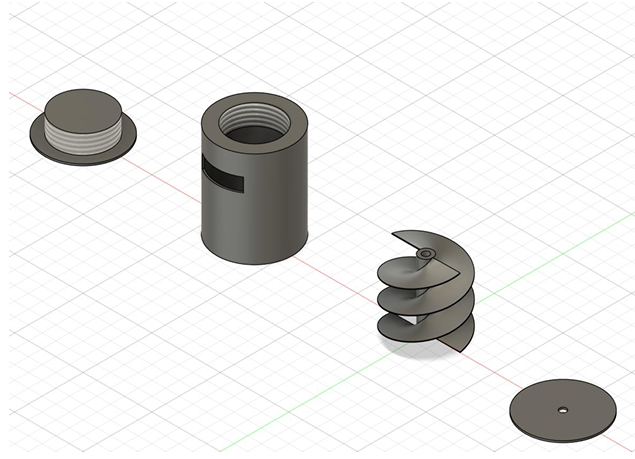
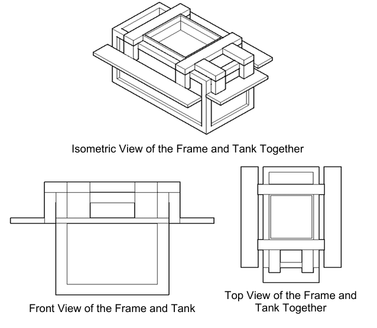
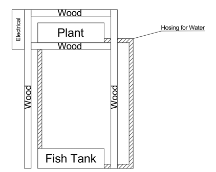
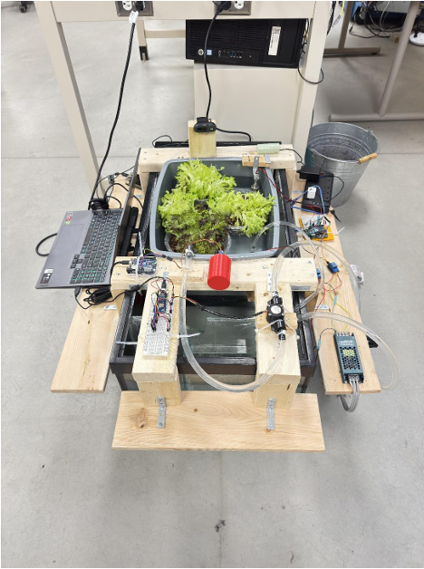
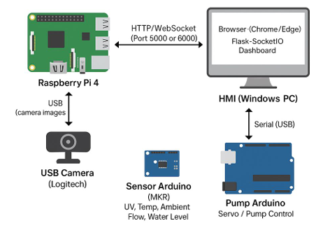
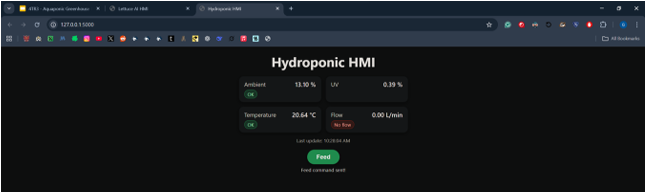
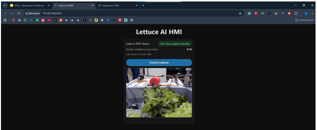

# Aquaponic System

## Table of Contents

- Abstract
- Introduction
- Literature Review and Project Overview
  - Objective
  - Literature Review
  - Project Components
  - Project Implementation
    - First Draft
    - Second Draft
    - Current Design
  - Auto Feeder Design
  - Parts List
  - System Overview
  - HMI and Data Acquisition
  - Conclusion
  - References

---

## Abstract

This project will focus on building an agricultural system typically known as aquaponics with remote monitoring and automation integration. Aquaponics is an ecosystem that combines raising fish and growing plants without a constant need for fertilization or cleaning [5]. In this system, fish waste will be the plants' main fertilizer source. The plants will convert the waste and purify the water and return it to the fish tank [6].

By introducing automation, this project aims to improve the system by introducing remote monitoring of critical parameters like phosphorus, nitrite, potassium, temperature, and overall plant health [3]. Additionally, it will provide real-time alerts in the event of human intervention. This integration should reduce monitoring from humans. These additions are expected to reduce manual monitoring, improve reliability, and support a more stable growing environment.

## Introduction

Automated systems in agriculture can improve the well-being of plants and animals. Aquaponics itself is an automated system with plants and fish surviving in tandem. With integrated sensing and potentially robotics, it can increase production and improve quality [3].

Using IoT infrastructure, including sensors, internet connectivity, cloud solutions, and computer-based AI, users can produce massive amounts of data that can be analyzed [8].

IoT enables data-sharing among multiple parties. This includes a wide range of tools, devices, and applications. In the agricultural sector, IoT is slowly becoming a part of everyday life for farmers to increase efficiency and research [3]. IoT allows the storage of data while retrieving vast quantities of “live” data. This technology is ideal for enhancing the understanding of the effectiveness of each given farming practice. Looking into aquaponics, the data that are being collected by sensors can enable the optimization of the number of fish and correlate it to the plant health. Thus, searching for the ideal fish to plant ratio for best practices.

## Literature Review and Project Overview

### Objective

An aquaponic system is already a naturally occurring, automated system. The key elements that the addition of monitoring provides are an alarm and notification system. The monitoring system should be monitoring the process variables, such as:

- Phosphorus
- Nitrogen
- Potassium
- water flow rates
- Temperature
- filter conditions
- water level
- the quality of the plantation

Based on the process variables, such as temperature and flow rate, these should be automated as control variables.

### Literature Review

Articles on aquaponics systems are readily available online, and some even include IoT integration. The articles with IoT implementations are big systems with a couple hundred to thousands of gallons of water capacity [1]. This project is focused on a small scale at home size for the average person.

From these articles, we can identify a couple of key monitoring components that will be important. These include flow, pH level, water levels, temperature, chemical levels (ammonia, nitrate, nitrite), and light levels [7]. Since our project has a budget and our focus is low cost, we will also need to ensure that the automated system will be kept low-cost as well. With low cost, some sensors will not be purchasable as they only offer industrial-level sensors. Ammonia, Nitrate, and Nitrite sensors will need to be substituted with at-home aquarium testing kits. Unfortunately, that will remove the autonomous testing aspect but will still reduce the overall need for daily monitoring of the system.

Aquaponics farming is not the standard at the moment. Furthermore, IoT adoption in agriculture is still in its early stages. It’ll take time before it becomes the standard. IoT comes with its own challenges, such as communication, often relying on LoRa, which has a smaller data transfer rate.

### Project Components

The project will use a media-based aquaponic system. This system has a simple design and should be beginner-friendly. The components needed will be:

- Fish tank
- Grow bed
- Water pump
- Air pump
- Microcontroller (e.g., Arduino)
- Sensors for water temperature, level, pH, flow and nutrient proxies
- Camera for plant health analysis
- Auto feeder mechanism

The components can be bought at several places. We will also look for the cheapest possible options to ensure minimized costs. Several places we will look to purchase include, but are not limited to, AliExpress, Amazon, Home Depot, and Walmart.

An automatic feeding system has been developed and is shown in the later section of the report. The parts will most likely be 3D printed and have been designed using AutoCAD Fusion. All aspects of automation will be controlled by the microcontroller, and data will be sent to the cloud, where the user can monitor and be notified to check on system parameters.

## Project Implementation

#### First Draft

The design of the automated aquaponics system includes:

- fish tank monitored for liquid level and temperature.
- air pump and water heater may not be connected to the microcontroller.
- water flow is represented as blue solid lines and wiring as black dotted lines.
- two flow transmitters for redundancy (before and after pump), with one being a cost-saving alternative.
- light management with an on/off switch.

The automation of the project will slightly change due to cost. Ammonia, nitrate, and nitrite sensors do not have cheap options; they are mainly industrial. These chemical levels will need to be checked monthly with an at-home aquarium testing kit. Other than monthly check-ins, the system is designed to be hands off until an alert notifies the user.
h

#### Second Draft

The second design adds moisture sensors to the plant area ensuring water is being absorbed in the soil. This moisture sensor can indicate blockages at the return line to the fish tank, causing flooding indicators. The second flow transmitter was removed as too redundant. A single flow transmitter at the pump output suffices.

#### Current Design

The current iteration is the final design and working prototype. The aim was to make the design compact with a removable frame on the fish tank. Compact design allows components to be closer, a modular system, and lower expense.

The basket in the middle is where plants grow. A pump takes fish tank water to the plant basket. Microcontrollers, breadboards, sensors, switches, and pumps are mounted on side planks. A drain in the basket returns water.

#### Auto-Feeder
Auto Feeder Design 
The initial design of an auto feeder system is shown below. The design is a simple turbine 
setup in an enclosed space. When it is time for feeding, the turbine is connected to a 
motor, which will spin pushing food into a hole. This design is a recreation inspired by 
aquarium fish feeders from online [4].

#### Parts List

| Item | Description and Use |
| --- | --- |
| Wood | Material used as the frame. |
| Screws and Nails | Type of fasteners used for building the frame. |
| Lettuce Plant | Plant used to grow in the growing bed. |
| Brackets | Metal support structure used for building the frame. |
| Cat litter box | Simple plastic box used as the growing bed. |
| Camera | Our visual monitoring component for the AI lettuce detector. |
| Water Pumps | Big water pump is to take water from the fish tank to the growing bed. Smaller pump is the draining system of the grow bed. |
| Air pump | Aeration system for the fish tank. |
| Raspberry Pi | AI module control. |
| ESP32 | Microcontroller for the system. |
| Relays | SPDT relays used to control higher power system. |
| Temperature Sensor | Used to monitor the ambient temperature of the plants. |
| Light Sensor | Used to monitor the amount of light the plants are receiving. |
| Level Switch | Low and High level monitoring switch of the grow bed’s water level. |
| UV Light Sensor | Monitors the amount of UV the plants receive. |
| Tank Heater | Small Heater to keep the tank water at an optimal temperature. |
| 12V Power Supply | Used to power the 12V equipment. |
| Clay Pellets | Material used as the growing media, allows for easy drainage. |
| Tank and Fish | Fish produce waste in the tank which is used to feed the plants. |
| Servo Motor | Driving motor of the auto feeder. |

#### System Overview

The project uses two coupled subsystems: 
1. AI subsystem (Raspberri Pi): 
Runs Linux and the AI/ML stack to determine the health of the plant through the 
camera. The Camera will capture shot upon request from user and image will be ran 
through the model and sent to HMI to show if any nutrients are missing. 
2. Control/IO subsystem (Arduino): 
Handles real-time tasks like reading sensors and driving actuators. 
Data collected from sensors is transmitted from Arduino, while photos captured from the 
camera of the plant health will be transmitted from Raspberri Pi. Both data will be shown on  
(refer to Appendix 2: Dual Coupling System Integration) 
Raspberri Pi will use MobileNetV2 to reduce load. Initially planned to use CNN for AI however, 
due to lack of power and cooling, this has not been possible. Instead, dataset are put into 
classification folders. There are four classes: 0_FN (healthy), 1_N (nitrogen deficient), 2_P 
(phosphorus deficient), and 3_K (potassium deficient). 
Data are transformed through horizontally flipped, rotated, blurred, and reduced sharpness to 
reflect the images coming from the camera. The HMI from AI will be a separate port. 

#### HMI for Sensors + Autofeeder

#### HMI for AI

## Conclusion

The integration of automation into aquaponic systems will increase the ease of operations. 
By monitoring key items and potentially automating some processes like flow rate and fish 
feed reduces the need for human monitoring. This project demonstrates the use of IoT in 
agricultural settings [3]. 
There are several limitations we faced: 
● Lack of wireless communication tools: Sensors and arduino needs a physical 
connection and that creates messy wiring and inability to be truely IoT. Another way 
is to use LoRa network to get serial data from sensors and receive data wirelessly to 
be used on HMI. 
● Computational power to run CNN: Raspberri Pi is not a great tool to run AI models 
on. It can run simple models like MobileNetV2. 
● Poor production quality of 3D printing: The 3D printed autofeeder parts have too 
much friction and unable to print the 2 swirls in the design. Instead, the project were 
limited to 1 swirl 
Given the high price of Nitrogen, phosphorus, and potassium sensors (NPK), it’s much  
affordable to use AI as a replacement. However, give a chance, having a comparison 
between AI and the NPK and be able to adjust our confidence levels to get a more accurate 
result. 

## References
1. A.M Bassiuny, M.M.M. Mahmoud, R. Darwish, "Development of an economic smart 
aquaponic system based on IoT”, Journal of Engineering Research, vol. 12, no. 4, 
pp. 886-894, Dec. 2024. [Online]. Available: 
https://www.sciencedirect.com/science/article/pii/S230718772300202X. 
2. A. S. Alon and J. L. Dioses, Jr., “Machine Vision Recognition System for Iceberg 
Lettuce Health Condition on Raspberry Pi 4b: A Mobile Net SSD v2 Inference 
Approach,” *International Journal of Emerging Trends in Engineering Research*, vol. 
8, no. 4, Apr. 2020. [Online]. Available: 
http://www.warse.org/IJETER/static/pdf/file/ijeter20842020.pdf 
3. M. McCaig, D. Rezania, and R. Dara, "A Scoping Review on Value Creation from 
Collaborations enabled by the Internet of Things in Agriculture," 2021 Fifth World 
Conference on Smart Trends in Systems Security and Sustainability (WorldS4), 
London, United Kingdom, 2021, pp. 1-5, doi: 
10.1109/WorldS451998.2021.9514045. 
4. PetSmart, "Top Fin® Fin Automatic Fish Feeder," Available: 
https://www.petsmart.ca/fish/food-and-care/feeders/top-fin-fin-automatic-fish
feeder-16405.html. Accessed: Apr. 6, 2025. 
5. Rakocy, J. E., Masser, M. P., & Losordo, T. M. (2006). Recirculating Aquaculture Tank 
Production Systems: Aquaponics—Integrating Fish and Plant Culture. SRAC 
Publication, 454. 
6. Somerville, C., Cohen, M., Pantanella, E., Stankus, A., & Lovatelli, A. (2014). Small
scale aquaponic food production: Integrated fish and plant farming. FAO Fisheries 
and Aquaculture Technical Paper, 589. 
7. Thingstel, "IoT in Aquaponics," Thingstel Blog. [Online]. Available: 
https://www.thingstel.com/blog/iot-in-aquaponics/. [Accessed: Mar. 2, 2025]. 
8. J. M. Perkel, “The Internet of Things comes to the lab,” Nature, vol. 542(7639) 

## Notes on storage

- The PDF content is now embedded in this README.
- The original PDF and DOCX files are not tracked in GitHub but can be stored externally in a `releases/` or `docs/` archive.

## Original report path (local)

- `Final_4TR3 Final Report.pdf` (local backup)
- `4TR3 - Aquaponic Greenhouse Final Presentation.pdf` (local backup)

## Project setup (short summary)

1. `python -m venv venv`
2. `venv\Scripts\activate` (Windows)
3. `pip install -r requirements.txt`
4. `python AI-model/AI_HMI/app.py`

## Dependencies

`requirements.txt` includes:
- flask
- flask-socketio
- requests
- opencv-python
- torch
- torchvision
- Pillow
- matplotlib
- pyserial

