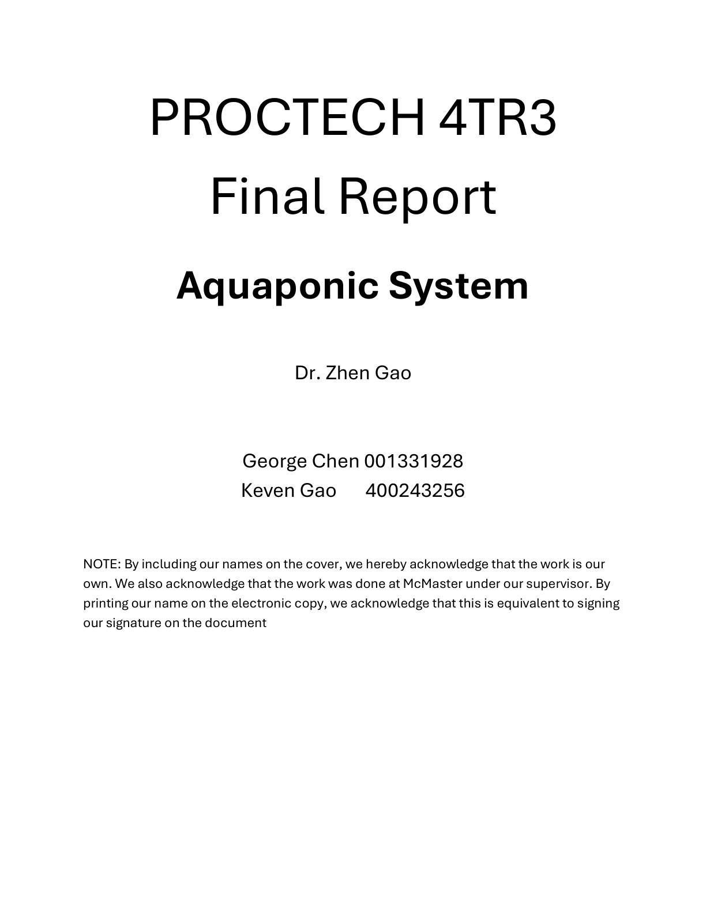
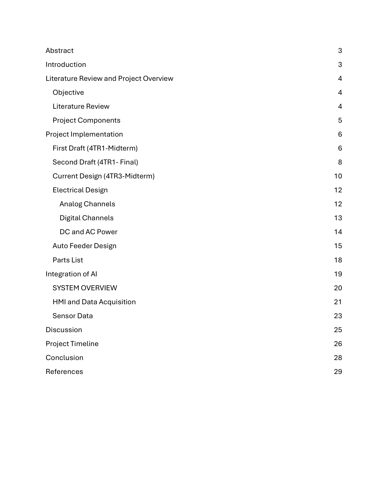
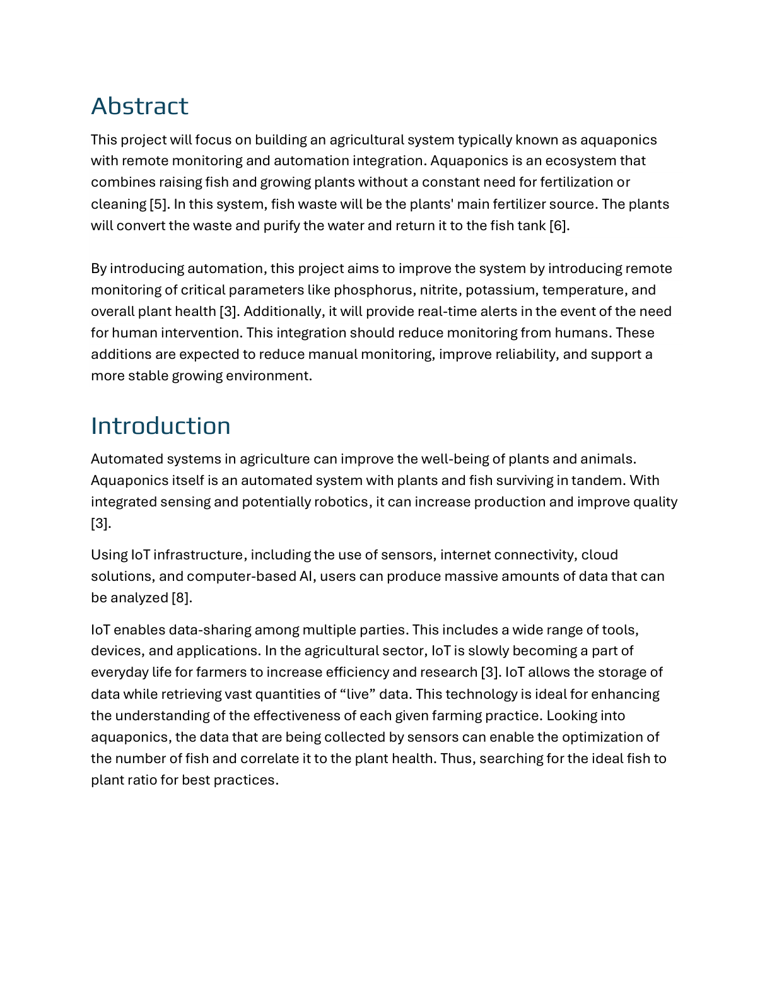

# Aquaponic System

This README now contains the contents extracted from `Final_4TR3 Final Report.pdf`.

## Cover Page

Aquaponic System

---

## Table of Contents

- Abstract
- Introduction
- Literature Review and Project Overview
  - Objective
  - Literature Review
  - Project Components
  - Project Implementation
    - First Draft (4TR1 - Midterm)
    - Second Draft (4TR1 - Final)
    - Current Design (4TR3 - Midterm)
  - Electrical Design
  - Analog Channels
  - Digital Channels
  - Auto Feeder Design
  - Parts List
  - Integration of AI
  - System Overview
  - HMI and Data Acquisition
  - Sensor Data
  - Discussion
  - Project Timeline
  - Conclusion
  - References

---

## Abstract

This project will focus on building an agricultural system typically known as aquaponics with remote monitoring and automation integration. Aquaponics is an ecosystem that combines raising fish and growing plants without a constant need for fertilization or cleaning [5]. In this system, fish waste will be the plants' main fertilizer source. The plants will convert the waste and purify the water and return it to the fish tank [6].

By introducing automation, this project aims to improve the system by introducing remote monitoring of critical parameters like phosphorus, nitrite, potassium, temperature, and overall plant health [3]. Additionally, it will provide real-time alerts in the event of human intervention. This integration should reduce monitoring from humans. These additions are expected to reduce manual monitoring, improve reliability, and support a more stable growing environment.

## Introduction

Automated systems in agriculture can improve the well-being of plants and animals. Aquaponics itself is an automated system with plants and fish surviving in tandem. With integrated sensing and potentially robotics, it can increase production and improve quality [3].

Using IoT infrastructure, including sensors, internet connectivity, cloud solutions, and computer-based AI, users can produce massive amounts of data that can be analyzed [8].

IoT enables data-sharing among multiple parties. This includes a wide range of tools, devices, and applications. In the agricultural sector, IoT is slowly becoming a part of everyday life for farmers to increase efficiency and research [3]. IoT allows the storage of data while retrieving vast quantities of “live” data. This technology is ideal for enhancing the understanding of the effectiveness of each given farming practice. Looking into aquaponics, the data that are being collected by sensors can enable the optimization of the number of fish and correlate it to the plant health. Thus, searching for the ideal fish to plant ratio for best practices.

## Literature Review and Project Overview

### Objective

An aquaponic system is already a naturally occurring, automated system. The key elements that the addition of monitoring provides are an alarm and notification system. The monitoring system should be monitoring the process variables, such as:

- Phosphorus
- Nitrogen
- Potassium
- water flow rates
- Temperature
- filter conditions
- water level
- the quality of the plantation

Based on the process variables, such as temperature and flow rate, these should be automated as control variables.

### Literature Review

Articles on aquaponics systems are readily available online, and some even include IoT integration. The articles with IoT implementations are big systems with a couple hundred to thousands of gallons of water capacity [1]. This project is focused on a small scale at home size for the average person.

From these articles, we can identify a couple of key monitoring components that will be important. These include flow, pH level, water levels, temperature, chemical levels (ammonia, nitrate, nitrite), and light levels [7]. Since our project has a budget and our focus is low cost, we will also need to ensure that the automated system will be kept low-cost as well. With low cost, some sensors will not be purchasable as they only offer industrial-level sensors. Ammonia, Nitrate, and Nitrite sensors will need to be substituted with at-home aquarium testing kits. Unfortunately, that will remove the autonomous testing aspect but will still reduce the overall need for daily monitoring of the system.

Aquaponics farming is not the standard at the moment. Furthermore, IoT adoption in agriculture is still in its early stages. It’ll take time before it becomes the standard. IoT comes with its own challenges, such as communication, often relying on LoRa, which has a smaller data transfer rate.

### Project Components

The project will use a media-based aquaponic system. This system has a simple design and should be beginner-friendly. The components needed will be:

- Fish tank
- Grow bed
- Water pump
- Air pump
- Microcontroller (e.g., Arduino)
- Sensors for water temperature, level, pH, flow and nutrient proxies
- Camera for plant health analysis
- Auto feeder mechanism

The components can be bought at several places. We will also look for the cheapest possible options to ensure minimized costs. Several places we will look to purchase include, but are not limited to, AliExpress, Amazon, Home Depot, and Walmart.

An automatic feeding system has been developed and is shown in the later section of the report. The parts will most likely be 3D printed and have been designed using AutoCAD Fusion. All aspects of automation will be controlled by the microcontroller, and data will be sent to the cloud, where the user can monitor and be notified to check on system parameters.

### Project Implementation

#### First Draft

The design of the automated aquaponics system includes:

- fish tank monitored for liquid level and temperature.
- air pump and water heater may not be connected to the microcontroller.
- water flow is represented as blue solid lines and wiring as black dotted lines.
- two flow transmitters for redundancy (before and after pump), with one being a cost-saving alternative.
- light management with an on/off switch.

The automation of the project will slightly change due to cost. Ammonia, nitrate, and nitrite sensors do not have cheap options; they are mainly industrial. These chemical levels will need to be checked monthly with an at-home aquarium testing kit. Other than monthly check-ins, the system is designed to be hands off until an alert notifies the user.

##### Visuals from report

#### Second Draft

The second design adds moisture sensors to the plant area ensuring water is being absorbed in the soil. This moisture sensor can indicate blockages at the return line to the fish tank, causing flooding indicators. The second flow transmitter was removed as too redundant. A single flow transmitter at the pump output suffices.

#### Current Design

The current iteration is the final design and working prototype. The aim was to make the design compact with a removable frame on the fish tank. Compact design allows components to be closer, a modular system, and lower expense.

The basket in the middle is where plants grow. A pump takes fish tank water to the plant basket. Microcontrollers, breadboards, sensors, switches, and pumps are mounted on side planks. A drain in the basket returns water.

## Notes on storage

- The PDF content is now embedded in this README.
- The original PDF and DOCX files are not tracked in GitHub but can be stored externally in a `releases/` or `docs/` archive.

## Original report path (local)

- `Final_4TR3 Final Report.pdf` (local backup)
- `4TR3 - Aquaponic Greenhouse Final Presentation.pdf` (local backup)

## Project setup (short summary)

1. `python -m venv venv`
2. `venv\Scripts\activate` (Windows)
3. `pip install -r requirements.txt`
4. `python AI-model/AI_HMI/app.py`

## Dependencies

`requirements.txt` includes:
- flask
- flask-socketio
- requests
- opencv-python
- torch
- torchvision
- Pillow
- matplotlib
- pyserial

